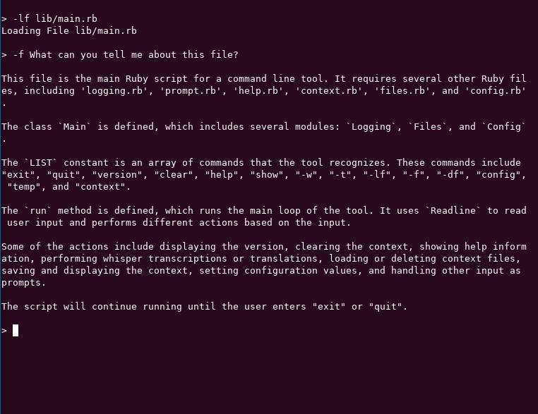
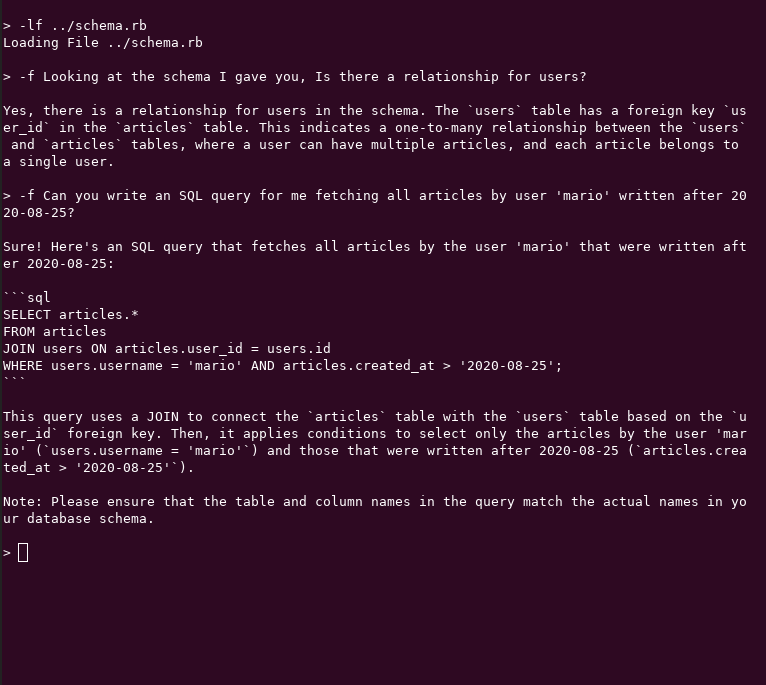
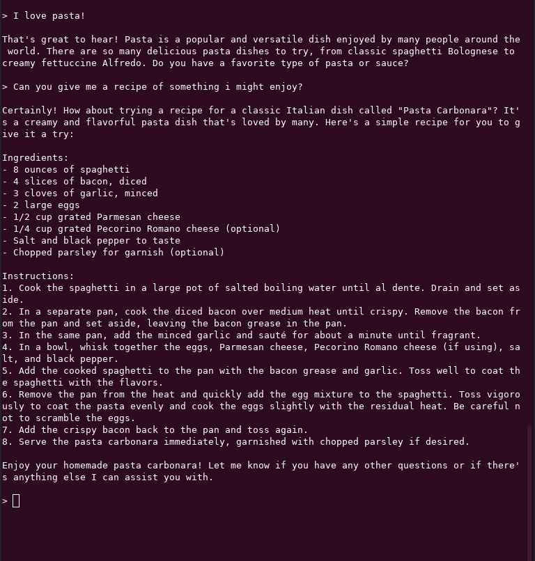

## ChatBOT (openAI) in your terminal

#### Disclaimer
Ad hoc created chatBOT cli tool. \
Do you want standards, conventions and best practice? \
Then this is not for you :angry:

This project is still a 'WIP'\


#### Prerequisites
Ruby installed \
Api key from [OpenAI](https://platform.openai.com/overview)

#### Installation
```
gem install ask-ai
```

You can then start an interactive session with:
```
ask-ai
``` 

Configure your API key\

```
config key <key>
```
#### Usage

Start your interactive session with:
```
ask-ai
```

You can load a file with ``` -lf path_to_file ``` then you can ask question about the file. \
Don't forget to use ```-f ``` when you want to ask about a file. \
(As of now you can only load files that can be read line by line, like txt, yml or code)



or something like



You can load more then one file, just be aware that a lot of input consumes more tokens. \
To delete files from context use ``` -df ``` to delete one or all loaded files.


You can also use it as chat bot, it by default save 10 Input / Output as a context



You can delete the conversation with:
```
clear
```


For all available commands type:
```
help
```


